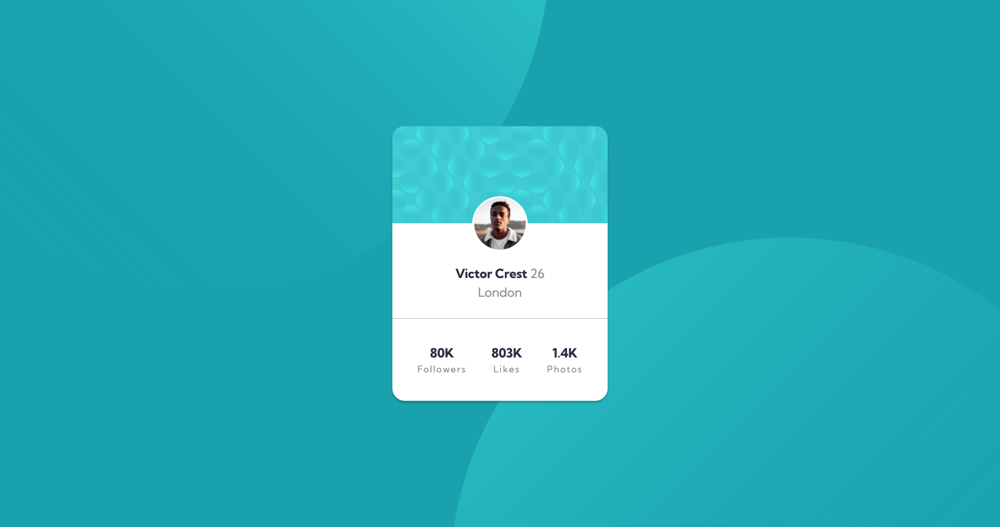

# Frontend Mentor - Profile card component solution

This is a solution to the [Profile card component challenge on Frontend Mentor](https://www.frontendmentor.io/challenges/profile-card-component-cfArpWshJ). Frontend Mentor challenges help you improve your coding skills by building realistic projects. 

## Table of contents

- [Overview](#overview)
  - [The challenge](#the-challenge)
  - [Screenshot](#screenshot)
  - [Links](#links)
- [My process](#my-process)
  - [Built with](#built-with)
  - [Continued development](#continued-development)
- [Author](#author)

## Overview

### The challenge

- Build out the project to the designs provided

### Screenshot



### Links

- [Solution](https://github.com/ryanthayes/fem-profile-card-component)
- [Live URL](https://ryanthayes.github.io/fem-profile-card-component)

## My process

### Built with

- Semantic HTML5 markup
- CSS custom properties
- Flexbox
- Mobile-first workflow

### What I learned

I learned that you can have two background images at the same time and that you can position them independently.

To see how you can add code snippets, see below:

```css
 background-image: 
    url(images/bg-pattern-top.svg),
    url(images/bg-pattern-bottom.svg);
    background-repeat: no-repeat, no-repeat;
    background-position: right 40vw bottom 40vh, left 40vw top 40vh;
```

## Author

- Github - [@ryanthayes](https://github.com/ryanthayes)
- Frontend Mentor - [@ryanthayes](https://www.frontendmentor.io/profile/ryanthayes)
